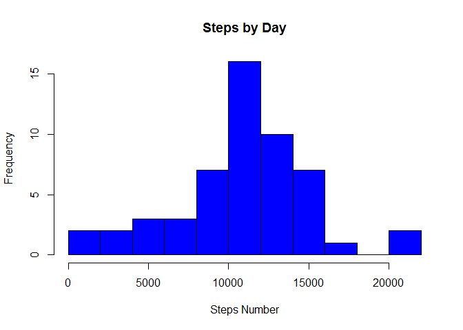
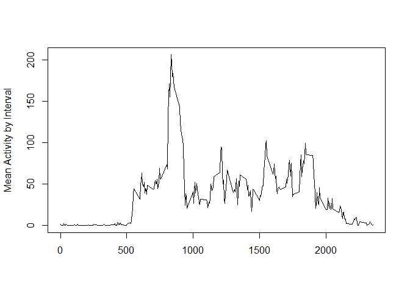
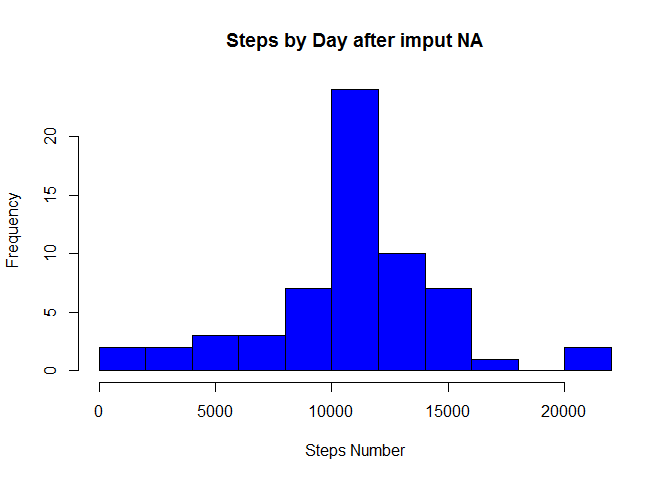
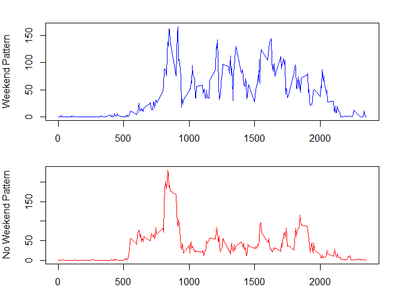

## Libraries needed 
dplyr
tidyr
stringr


## Loading and preprocessing the data

```r
## Code for reading in the dataset and/or processing the data
setwd("F:/Coursera/R/RepData_PeerAssessment1-master/RepData_PeerAssessment1")
myfile <- read.csv(unz("activity.zip", "activity.csv"))

activy_df <- myfile[!is.na(myfile$steps) ,]
activy_df$date <- as.Date(activy_df$date)
activy_df$hour <-
        paste0(
                str_pad(activy_df$interval %/% 100, 2, "left", '0'),
                ":",
                str_pad(activy_df$interval %% 100, 2, "left", '0')
        )
sum <- activy_df %>% select(date, steps)  %>%
        group_by(date) %>%
        summarise_each(funs(sum))
dfaa <-
        hist(
                as.numeric(sum$steps),
                col = "blue",
                main = "Steps by Day",
                xlab = "Steps Number",
                breaks = 10
        )
```

<!-- -->


## What is mean total number of steps taken per day?

```r
mean_steps_by_day <- mean(sum$steps)
median_steps_by_day <- median(sum$steps)
mean_steps_by_day
```

```
## [1] 10766.19
```

```r
median_steps_by_day
```

```
## [1] 10765
```


## What is the average daily activity pattern?

```r
mean_act_ptt <- activy_df %>% select(interval, steps)  %>%
        group_by(interval) %>%
        summarise_each(funs(mean))
time_serie <-
        plot(
                mean_act_ptt$interval,
                mean_act_ptt$steps,
                type = "l",
                xlab = "",
                ylab = "Mean Activity by Interval"
        )
```

<!-- -->


## Imputing missing values

```r
na_vector <- which(is.na(myfile$steps))
for (i in 1:length(na_vector)) {
 myfile[na_vector[i],]$steps <-
        mean_act_ptt[mean_act_ptt$interval == myfile[na_vector[i],]$interval,]$steps
}
## Histogram of the total number of steps taken each day after missing values are imputed
sum_na <- myfile %>% select(date, steps)  %>%
        group_by(date) %>%
        summarise_each(funs(sum))

hist_no_na <-
        hist(
                as.numeric(sum_na$steps),
                col = "blue",
                main = "Steps by Day after imput NA",
                xlab = "Steps Number",
                breaks = 10
        )
```

<!-- -->


## Are there differences in activity patterns between weekdays and weekends?

```r
## Panel plot comparing the average number of steps taken per 5-minute interval across weekdays and weekends
df_wk <-myfile[lubridate::wday(myfile$date) %in% c(1, 7),]
wk_act_ptt <- df_wk %>% select(interval, steps)  %>%
        group_by(interval) %>%
        summarise_each(funs(mean))

df_no_wk <-myfile[lubridate::wday(myfile$date) %in% c(2, 3, 4, 5, 6),]
no_wk_act_ptt <- df_no_wk %>% select(interval, steps)  %>%
        group_by(interval) %>%
        summarise_each(funs(mean))

op <- par(mfcol = c(2,1), mar = c(2,4,2,2))
plot(wk_act_ptt$interval, wk_act_ptt$steps, type = "l", xlab = "", ylab = "Weekend Pattern", col = "blue")
plot(no_wk_act_ptt$interval, no_wk_act_ptt$steps, type = "l", xlab = "", ylab = "No Weekend Pattern",col = "red")
```

<!-- -->

